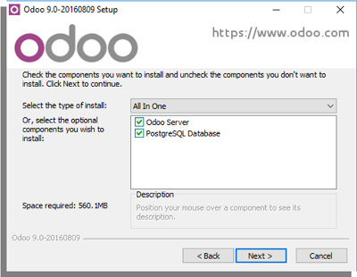
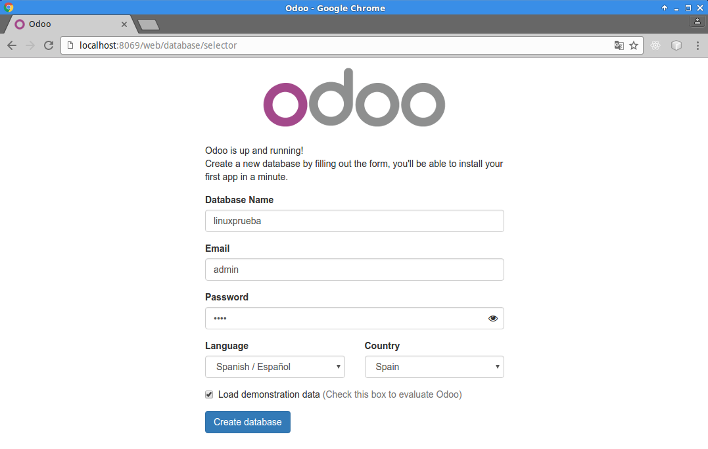
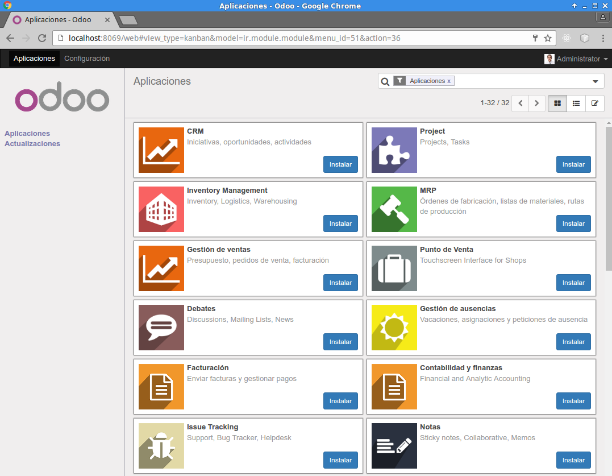
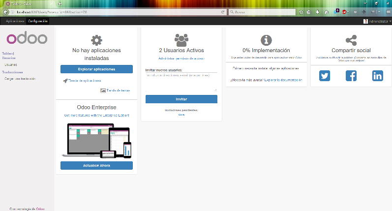
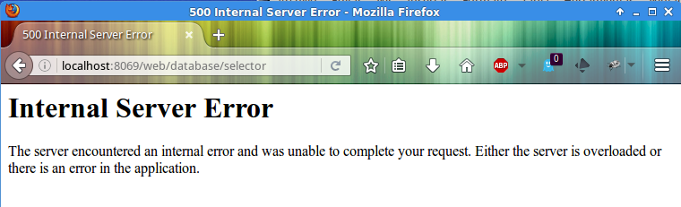
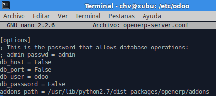

#1.- Instalación.
Desde la página web oficial podemos descargarnos la última versión de Odoo, en nuestro caso, **la 9c**, del 08 de agosto de 2016. Podremos seleccionar los distintos sistemas operativos disponibles para instalar Odoo: **MS Windows, GNU/Linux, así como el código fuente.**

A continuación mostraremos los diferentes tipos de instalación:

##1.1.- Mediante Uso de paquetes EXE (MS Windows) / DEB (GNU/Linux).
###1.1.1.- MS Windows.
Descargado el fichero  **"odoo_9.0c.latest.exe"** lo ejecutaremos en modo administrador y seguiremos las instrucciones del asistente de instalación (en inglés y/o francés), aceptaremos los términos y condiciones, y tendremos la siguiente ventana en nuestro escritorio:



El asistente nos indica de que hay tres tipos de instalación de los componentes necesarios:
1. *All In One* (todo en uno), opción seleccionada por defecto.
2. *Server Only*, si queremos Odoo únicamente.
3. *Custom*.

Nosotros seleccionaremos "All In One" por lo que necesitaremos 560 MB libres de espacio en disco, una vez que aceptemos y cliquemos en siguiente será el momento de configurar nuestra conexión al motor de la Base de Datos PostgreSQL, por defecto el asistente tendrá los siguientes valores introducidos por defecto:

| Campo | Valor | Descripción |
|:--------:|:--------:|:---------:|
| *Hostname* | ***localhost*** | Nombre de la máquina o equipo, puede ser una IP |
| *Port* | ***5432*** | Número de puerto |
| *Username* | ***openpg*** | Nombre del usuario |
| *Password* | ***openpgpwd*** | Contraseña del usuario |

El siguiente paso será indicar la ruta (carpeta) dónde queremos instalar los componentes seleccionados, por defecto será en `C:\Archivos de Programa\Odoo 9.0-20160809`. Pulsaremos el botón install para que el asistente proceda a la extracción de los ficheros y su instalación.

Finalizado el asistente y hemos indicado que **inicie Odoo** *(start odoo)* se abrirá nuestro navegador web por defecto con la siguiente URL `localhost:8069/web/database/selector` y nos mostrará la siguiente página:

>

Tendremos que rellenar los campos correspondientes para empezar con "nuestra empresa" (que será una base de datos):
+ Indicaremos el nombre de la base de datos, en nuestro ejemplo: "linuxprueba".
+ Escribimos el correo electrónico, que bien puede ser una palabra o lo que queramos.
+ Establecemos la contraseña, por ejemplo "abcd".
+ Seleccionamos el idioma deseado.
+ Indicamos el país.
+ También tenemos la posibilidad de cargar datos de demostración o no.

Una vez rellenados todos los campos, ya podemos crear nuestra empresa, recordemos que la operación durará algunos minutos. 

>Después la ventana del navegador se refrescará y nos mostrará todas las aplicaciones que trae el paquete de instalación:

>

>Donde podremos alternar entre la vista de aplicaciones (actualmente cargada) o el estado de la configuración en que se encuentra nuestra empresa:

>

>Podemos ver qué aplicaciones tenemos instaladas, controlde usurios, implementación realizada, compartir con las redes sociales o bien adquirir la versión empresarial. 

###1.1.2.- GNU/Linux.
Como hemos comentado, también podemos obtener la versión 9c para Ubuntu/Debian mediante paquetes DEB o RPM, nosotros hemos optado por instalar Odoo en Ubuntu, por lo que nos descargaremos el fichero **"odoo_9.0c.latest_all.deb"**, una vez descagado tendremos que cambiar los permisos mediante `chmod 770 odoo_9.0c.latest_all.deb`
Para proceder a la instalación necesitaremos el siguiente comando `sudo dpkg -i odoo_9.0c.latest_all.deb` pero el sistema nos indicarán que **hay dependencias incumplidas y no es posible instalar Odoo**. 
Para arreglar esto, utilizaremos el comando `sudo apt-get -f install` para corregir las dependencias, descargarlas y después instalar Odoo. Después nos mostrará el mensaje de que Odoo está iniciado. Entonces si accedemos a nuestro navegador con la URL antes indicada para MS Windows:

>

No se puede mostrar Odoo porque no tenemos instalado previamente PostgreSQL, así que primero instalaremos el servidor de base de datos utilizando el siguiente comando: `sudo apt-get install postgresql pgadmin3` instalando las versiones 9.3 y 1.18.1 respectivamente.

Ya instalado PostgreSQL y su gestor gráfico, procederemos a crear el usuario **odoo** para poder acceder a PostgreSQL y crear las bases de datos, tablas, etc., necesarias:
```bash
mach@user:~$ sudo su - postgres
postgres@user:~$ createuser --createdb --username postgres --no-createrole --nosuperuser --pwprompt odoo
postgres@user:~$ exit
```
Ahora lo que tendremos que hacer será modificar el fichero de configuración de Odoo que se encuentra en `etc/odoo/openerp-server.conf` y modificar el fichero:

>  
> Modificaremos:
> 1. Descomentaremos **admin_passwd**, también podemos indicar otro password.  
> 2. Estableceremos **db_host = localhost**.  
> 3. Indicaremos el puerto en el que escucha PostgreSQL **db_port = 5432**.  
> 4. El usuario **odoo** ya está puesto por defecto en **db_user**.  
> 5. Pondremos la contraseña **db_password = 1234**.  

Guardaremos los cambios y reiniciaremos con `sudo service odoo restart`.


###asdasd


> También podremos cambiar el orden:
> Primero instalar PostgreSQL y su 


RESUMEN PARA LINUX


## Referencias
+ [Página Oficial Odoo.](https://www.odoo.com/es_ES/)

+ [Odoo install packages](https://www.odoo.com/documentation/9.0/setup/install.html#setup-install-packaged)